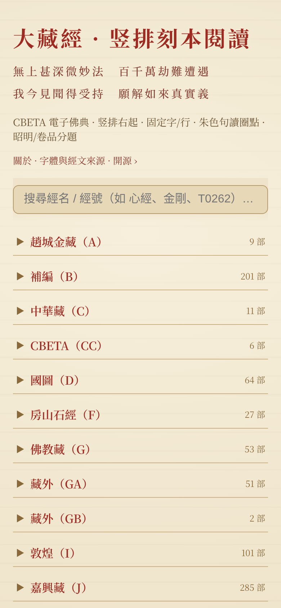
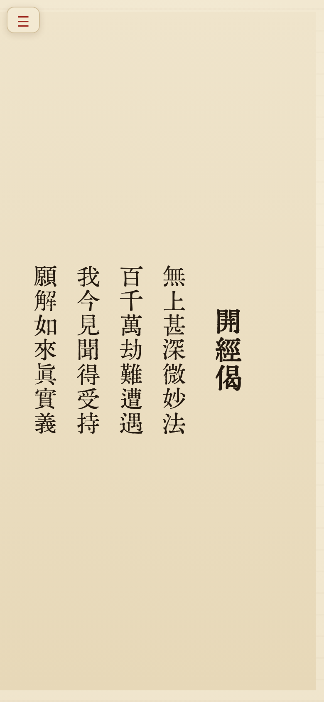
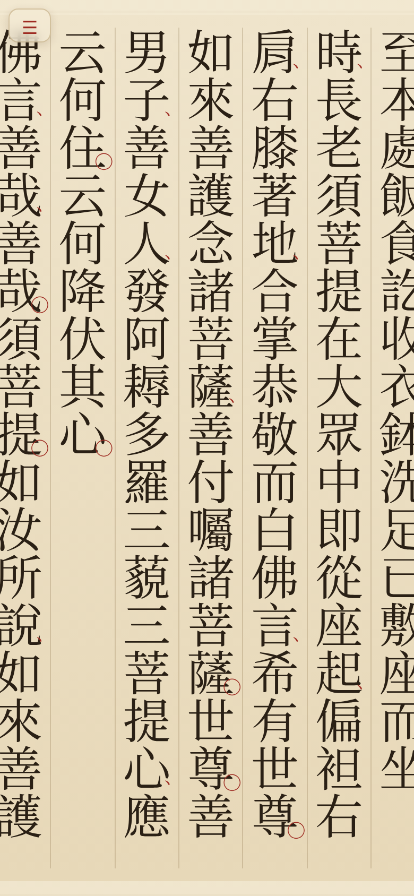
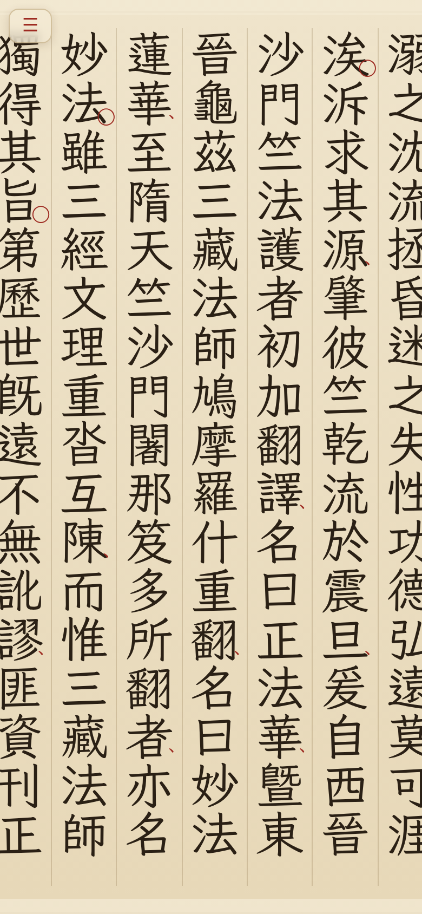
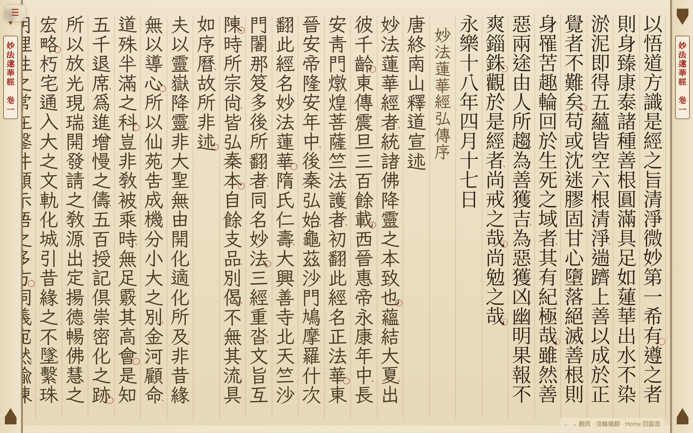
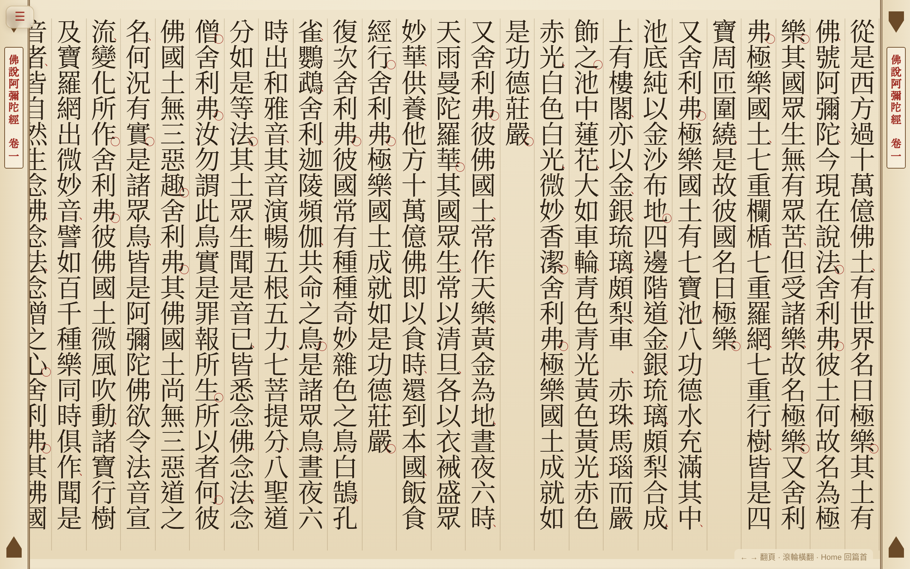

# 大藏經 · 竖排刻本閱讀 / Vertical Woodblock Tripitaka Reader

一款把 **CBETA 电子佛典**以**古籍竖排刻本**风格呈现的阅读器 —— Android App + Web，**完全离线**。

A reader that renders the **CBETA Buddhist canon** in the style of a **vertical
woodblock print**, as an Android app and a web page, **fully offline**.

在线体验 / Live demo: <https://hk2.guyii.net/cbeta/>

---

## 截图 / Screenshots

### 手机 · 竖屏 / Phone (portrait)

<p>
  
  
  
  
</p>

首页目录 ｜ 心經·開經偈牌记页（京華老宋）｜ 金剛經（令东齐伋·明刻本）｜ 法華經（霞鹜文楷）

### 平板 · 横屏 / Tablet (landscape)

<p></p>
<p></p>

法華經弘傳序（汇文明朝，含左右**版框鱼尾栏**与**书耳**）｜ 阿彌陀經（思源宋）

> 五款可切正文字体：京華老宋 · 汇文明朝 · 令东齐伋 · 思源宋 · 霞鹜文楷

---

## 特性 / Features

- **竖排右起**、固定每列字数（15/17/20 可切）、朱色句读圈点
- **雙行夾註**（古籍夹注双行小字）、序题楷体、卷/品分题
- **缺字**（CBETA 组字式）以 □ 占位；**生僻字**（Ext-B+）以 Plangothic 兜底
- 5 款可切正文字体（京華老宋 / 汇文明朝 / 令东齐伋 / 思源宋 / 霞鹜文楷）
- 目录折叠浏览、简体搜索、书签、夹注开关
- Android：完全离线，经藏库随包（zstd + 训练词典压缩）；平板/手机自适应

## 编辑原则 / Editorial principles

- **忠实底本，不代施句读。** 阅读器只呈现 CBETA 底本原有的标点。不同藏经底本
  不同：**大正藏（T）** 等经近代整理、带新式标点；而**龍藏（L，乾隆藏）**、
  **嘉興藏（J）** 里的许多**禪師語錄**等系照旧刻本**白文**录入、本无句读。凡底本
  为白文者，本阅读器**如实保留其无标点原貌**，不做机器自动断句——自动断句属推测、
  非权威，古文（尤禪語）易断错，会为经文“添加”原本没有的东西。这是对底本的
  学术尊重，并非渲染缺失。
  <br>*Faithful to the source; no editorial punctuation is added.* The reader shows
  only the punctuation present in the CBETA source. Canons such as the Taishō (T)
  are modern punctuated editions, whereas many Chan recorded-sayings in the
  Qianlong (L) and Jiaxing (J) canons were transcribed as **unpunctuated** classical
  text. Where the source is unpunctuated, the reader **preserves it as-is** and does
  **not** auto-segment — machine segmentation is conjectural and error-prone.

- **阿拉伯数字转中文数字。** 底本（多见于现代白话序跋）中的阿拉伯数字一律转为
  中文数字以契合竖排刻本体例：年份按读法（`1925`→一九二五），其余按数值
  （`21`→二十一、`80`→八十、`3360`→三千三百六十）。
  <br>Arabic numerals in the source (mostly in modern prefaces) are converted to
  Chinese numerals to suit the vertical woodblock style.

## 结构 / Structure

```
.                     Android app (Gradle, Kotlin, minSdk 26 / target 34)
├── app/
│   ├── src/main/java/com/wangsuo/tripitaka/
│   │   ├── MainActivity.kt      # 全屏 WebView + WebViewAssetLoader + 系统栏避让
│   │   ├── DataPathHandler.kt   # 拦截 data/*、catalog.json → SQLite
│   │   └── SutraStore.kt        # SQLite + zstd(词典) 只读经藏库
│   └── src/main/assets/web/
│       ├── index.html           # 首页目录
│       ├── reader.html          # 竖排渲染器（纯前端，Web/App 共用）
│       └── about.html           # 关于/版权
└── pipeline/                    数据管线（Python）
    ├── cbeta_prep.py            # CBETA txt → 紧凑 JSON（含夹注/缺字/序/句读）
    ├── batch_notes.py           # 存量 JSON 批量补夹注/缺字（幂等）
    └── build_db.py              # JSON → SQLite（zstd + 训练词典）
```

## 构建 / Build

**数据（不含在仓库）**：需 CBETA 电子佛典纯文本，跑
`pipeline/cbeta_prep.py <out> ALL` 生成 JSON，再 `pipeline/build_db.py` 打成
`app/src/main/assets/db/tripitaka.db`。

**字体（不含在仓库）**：从 `NOTICE.md` 列出的来源获取，用 `fontTools` 子集化后
放入 `app/src/main/assets/web/font/`。

**APK**：`./gradlew assembleDebug`（JDK 17 + Android SDK 34）。
正式版经藏库走 Play Asset Delivery install-time 资产包。

## 许可 / License

- **源代码**：MIT（见 `LICENSE`）
- **经文数据**：CBETA 授权（非营利 + 署名）
- **字体**：各自协议（SIL OFL 1.1 / 免费商用，见 `NOTICE.md`）

## 作者 / Author

guyiicn@gmail.com
